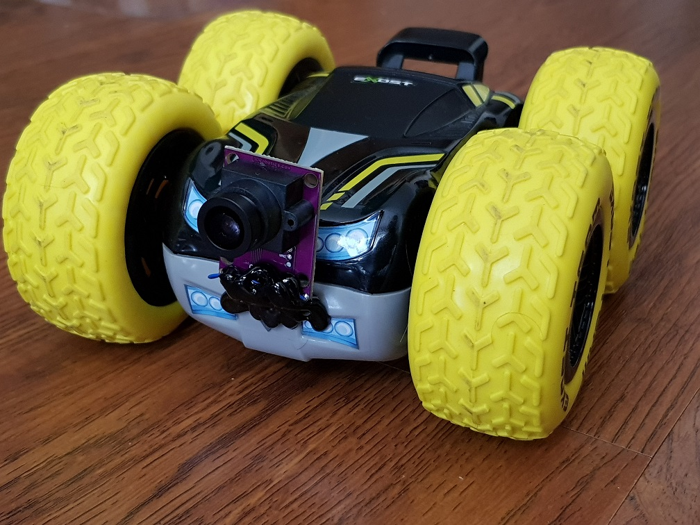
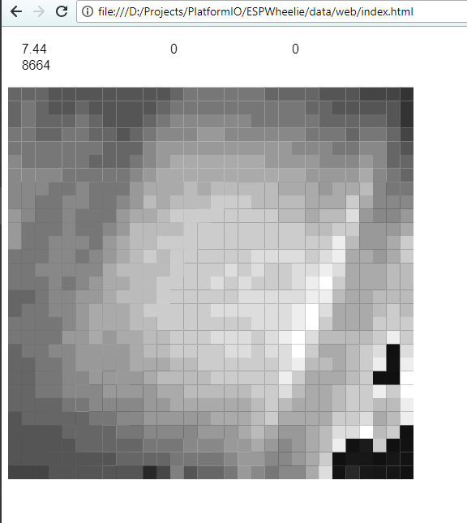
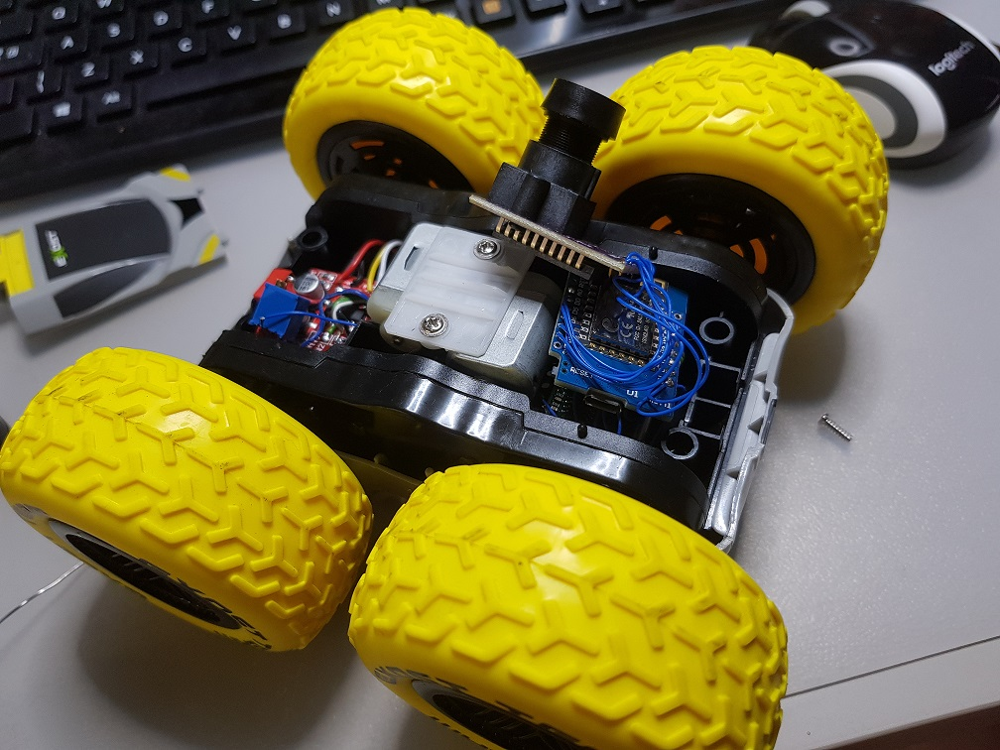

# ESPWheelie
ESP8266 Controlled four wheeled robot toy with A3080 mouse sensor as a camera

# How it works

Chinese HBridge driver and ADNS3080 mouse sensor module are connected to Wemos D1 mini
which serves a simple web page that allows to control the robot using touch gestures.
Image retrieved using ADNS3080 is transferred to the web page using WebSockets as well as commands
sent to the robot.

The robot is powered using two LiPo 1200mAh batteries forming a 2S1P battery.
A potentiometer connected to GND and Battery Plus scales battery voltage which is fed to
Analog pin of the Wemos board and subsequently is displayed on the web page.

Mechanically the robot consists of four wheels with each sides spinning independently. Interestingly
enough, this toy has two wheels of the same side connected to one motor. So that all two pairs
of wheels rotate independently like in a tank.

# Acknowledgements

Code for ADNS3080 was copied and refactored from https://github.com/Neumi/ESP8266_ADNS3080_reflectivity_finder
